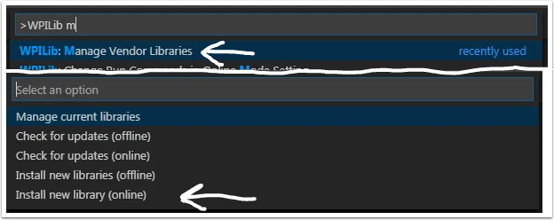

This guide will have 2 parts, installation and a basic swerve setup.

# What is BobcatLib? 🤔
On Team 177, we often reuse similar code from year to year because many parts of the robot, like the swerve drive, require essentially the same controls. However, directly copying and pasting code is challenging due to small, season-specific differences. BobcatLib simplifies this by providing a set of core, reusable components. These core elements allow us to efficiently build season-specific functionality on top of a reliable foundation.

# Installation 🛜
You install BobcatLib in the same way you intstall any other vendor dependancy. First, press `Ctrl+Shift+P` and type in **"Manage Vendor Libraries"**, you should see an option pop up that says `WPIib: Manage Vendor Libraries`, click on it.

This is the panel where you can install, delete, or update vendor libraries (Also called Vendor Dependencies or VendorDeps). Click on `Install new library (online)`. 

Next, you will tell WPILib where to download the vendordep from. Copy and paste **https://bobcatrobotics.github.io/BobcatLib2.0/BobcatLib.json** into the box, then press enter.

After the vendordep intstalls, it may ask you if you want to run a "Build" to ensure vendordeps are installed properly, you can ignore this for now.

More info on installing vendordeps [here](https://docs.wpilib.org/en/stable/docs/software/vscode-overview/3rd-party-libraries.html).

# Whats next? ✨

Now that you have BobcatLib installed, you can start coding your robot! To get started with swerve, go the the [swerve tutorial](Swerve/Swerve-intro.md)