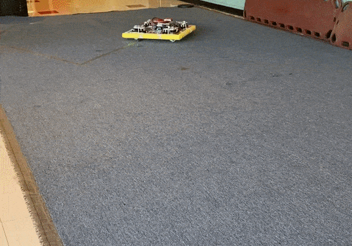

# Swerve
A swerve drive train is a highly maneuverable robot drive system where each wheel can independently rotate 360 
degrees and control its speed. This design allows the robot to move in any direction—forward, sideways, 
or even diagonally, without needing to turn its chassis. We use swerve drive because it provides unmatched agility and speed,
making it ideal for navigating tight spaces and quickly aligning with game pieces or field elements during competition.

